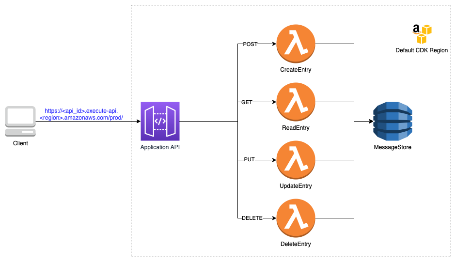

## AwsCdkApiLambdaDdbCrudExample

### What is this application about ?
* A very simple application in [typescript](https://www.typescriptlang.org) that demonstrates a backend using the following components from [AWS](https://aws.amazon.com)
  * [API Gateway](https://aws.amazon.com/api-gateway/)
  * [Lambda](https://aws.amazon.com/lambda/)
  * [DynamoDb](https://aws.amazon.com/dynamodb/)

---

### What are we deploying ?



* A simple backend, where we set up an API (non-Auth) that helps you interact with a message store based on DynamoDb as seen below through [REST](https://en.wikipedia.org/wiki/Representational_state_transfer).

| MessageId (String) | Message (String) | 
|--------------------|:----------------:|
| MessageId1         |    Message-1     |
| MessageId2         |    Message-2     |  
| MessageIdn         |    Message-n     |

---

### Instructions

#### Note
I highly encourage you to read and understand the code first to see what is happening under the hood. I'm also assuming that you did your due 
diligence in **understanding the costs involved for setting up this infrastructure**. 

That said lets get going....

#### Pre-Requisites
* You have node and npm installed. I highly encourage using [nvm](https://github.com/nvm-sh/nvm) for easy management of node versions. 
* You have installed and configured `aws-cdk`. If not you can find the configuration instructions [here](https://docs.aws.amazon.com/cdk/v2/guide/getting_started.html).
  * Important: This application refers to env vars from cdk `CDK_DEFAULT_ACCOUNT` and `CDK_DEFAULT_REGION`. More information on this can be found [here](https://docs.aws.amazon.com/cdk/v2/guide/environments.html).
  * If you don't want the above env vars to be referred, replace accordingly in [`bin/index.ts`](bin/index.ts).
  * The AWS profile you would use for deployment has necessary [IAM permissions](https://aws.amazon.com/iam/features/manage-permissions/) to create, modify or even delete AWS resources.
* You have [docker](https://www.docker.com) installed, up and running. (`cdk synth` and `cdk deploy` spin up a docker container to synthesize the application template and build your lambdas for deployment)
* Configure an env var `POOR_MANS_API_KEY` with a random string, IRL you would use [API gateway's API keys](https://docs.aws.amazon.com/apigateway/latest/developerguide/api-gateway-api-usage-plans.html) 
combined with [Sigv4](https://docs.aws.amazon.com/general/latest/gr/signature-version-4.html) or [Cognito](https://aws.amazon.com/cognito/) for AuthZ to protect your API (YMMV), but to keep this example simple and prevent abuse, we do this. 
Alternatively you can also configure your shell with an export such as `export POOR_MANS_API_KEY=<YOUUR_RANDOM_STRING>`, more detail of this implementation in [`lib/lambda/assets/utils.ts`](lib/lambda/assets/utils.ts) and [`lib/lambda/application-lambdas.ts`](lib/lambda/application-lambdas.ts).
If this is configured incorrectly your APIs will return a HTTP Status 400.

#### Steps
* `cdk bootstrap aws://<ACCOUNT NUMBER>/<CDK_DEFAULT_REGION/YOUR_CONFIGURED_REGION>`
* `cdk synth`
* `cdk deploy`

If everything went through fine, you will see a CLI output from `cdk deploy` something similar to below once its done deploying. 

```
 ✅  ApplicationStack
✨  Deployment time: 75.08s
```


That's it....😊! Congrats!

### Testing Your API With Postman
You can use `cURL` to test your API as well, but just for context and convenience, I prefer postman as its easy to share with the exported file as you will see below. If you are `cURL`er, skip to next section 😉
* Download [Postman](https://www.postman.com/downloads/).
* Get the API ID from API Gateway.
  * Navigate to your API Gateway console. For example if you deployed to `us-west-2`, you would go to https://us-west-2.console.aws.amazon.com/apigateway/main/apis?region=us-west-2.
  * Find the API with name `Application Service`, copy down the `ID`.
* Import [this file](postman/AwsCdkApigLambdaDdbCrudExample.postman_collection.json) into your postman application and alter the below for each URL (OR) alternatively edit the file prior to importing.
  * Replace `YOUR_API_ID` with the `ID` you copied from above.
  * Replace `your-aws-region` with the aws region your application has been deployed to.
  * Replace `POOR_MANS_API_KEY` with the key you used from pre-requisites.
  * Note: You will need to clear out some UUIDs (for get/update/delete) which will not apply to you as they are random. Replace them with your `MessageId`'s accordingly.

### Testing Your API with `cURL`
Note: You need to replace `YOUR_API_ID`, `your-aws-region`, `POOR_MANS_API_KEY` and `{MessageId}` for `cURL`s. 

#### POST (Create)
```shell
curl --location --request POST 'https://YOUR_API_ID.execute-api.your-aws-region.amazonaws.com/prod/messages?validationKey=POOR_MANS_API_KEY' \
--header 'Content-Type: text/plain' \
--data-raw '{
    "Message": "Hello from the other side - Adele"
}'
```

#### GET (Read)
```shell
curl --location --request GET 'https://YOUR_API_ID.execute-api.your-aws-region.amazonaws.com/prod/messages/{MessageId}?validationKey=POOR_MANS_API_KEY'
```

#### PUT (Update)
```shell
curl --location --request PUT 'https://YOUR_API_ID.execute-api.your-aws-region.amazonaws.com/prod/messages?validationKey=POOR_MANS_API_KEY' \
--header 'Content-Type: application/json' \
--data-raw '{
    "MessageId": "27d2fe03-2d24-48fa-a80c-434af7deba2c",
    "Message": "Update from post master"
}'
```

#### DELETE (Delete)
```shell
curl --location --request DELETE 'https://YOUR_API_ID.execute-api.your-aws-region.amazonaws.com/prod/messages/{MessageId}?validationKey=POOR_MANS_API_KEY'
```

---

### To-Do (PRs welcome!!!)
- [ ] More updated to readme with dir structure and explanations.
- [ ] Write unit tests for CDK and lambdas.
- [ ] Setup CD Pipeline with `CodeCommit` and `CodePipeline`